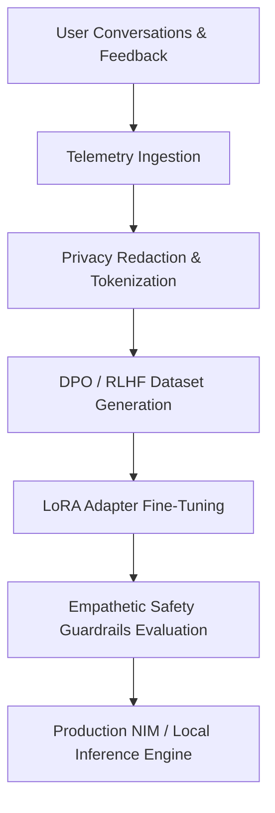

# AI Pattern Learning & Menstrual Cycle Prediction: System Architecture & Training Blueprint

## 1. Executive Overview

Her Intelligent Mate (HIM) is designed to be the world's premier feminine wellness AI companion. To deliver truly personalized, deeply empathetic, and scientifically precise care, HIM incorporates two foundational machine learning (ML) pillars:

1. **Conversational Communication Pattern Learning & Response Prediction**: A system that models individual communication nuances, emotional baseline shifts, phase-correlated sentiment, and conversational cadence to predict user needs and generate personalized responses.
2. **Adaptive Menstrual Cycle & Ovulation Prediction Engine**: A time-series predictive engine that moves beyond simplistic static 28-day calendar math, employing Bayesian time-series analysis and recurrent neural networks (LSTM / Transformer) to learn each user's unique biological rhythms and accurately forecast irregular cycles.

---

## 2. Communication Pattern Learning Architecture

### 2.1 Problem Formulation
Conventional conversational AI assistants treat every user identically and react only to immediate inputs. HIM learns longitudinal patterns:
- How does a user's tone change between their **Follicular Phase** (high energy, forward-looking) and **Luteal/PMS Phase** (vulnerable, sensitive, low battery)?
- What communication styles does the user prefer? (Gentle reassurance vs. actionable wellness tips vs. quiet presence).
- What vocabulary or emotional triggers indicate severe PMS or anxiety?

### 2.2 Data Collection & Telemetry Schema
Every user-assistant interaction is logged with rich physiological and emotional telemetry:

```sql
-- Schema for AI Training Telemetry
CREATE TABLE ai_conversational_telemetry (
  id SERIAL PRIMARY KEY,
  user_id INT NOT NULL REFERENCES users(id),
  session_id INT REFERENCES chat_sessions(id),
  cycle_phase VARCHAR(50) NOT NULL,
  cycle_day INT NOT NULL,
  user_utterance TEXT NOT NULL,
  user_sentiment_score FLOAT, -- -1.0 (distressed) to +1.0 (joyful)
  detected_intent VARCHAR(100),
  ai_response TEXT NOT NULL,
  ai_model_version VARCHAR(50),
  user_latency_ms INT,
  user_feedback_score INT, -- 1 to 5 stars or thumbs up/down
  symptom_context JSONB,   -- { "cramps": 3, "fatigue": 4, "headache": 1 }
  created_at TIMESTAMP WITH TIME ZONE DEFAULT CURRENT_TIMESTAMP
);
```

### 2.3 Feature Engineering for Response Prediction
The input feature vector for predicting optimal responses combines:
- **Linguistic Embeddings**: Dense semantic representations (768-dim from text-embedding-3 or local MiniLM) of the user's recent 5 messages.
- **Temporal & Biological Features**:
  - `cycle_day / avg_cycle_length` (Normalized phase progression)
  - `days_until_next_period`
  - `rolling_mood_average_3d` (3-day moving average of sentiment)
  - `time_of_day_sin / cos` (Circadian context for morning check-ins vs. late-night insomnia)
- **Conversational Preference Weights**:
  - `validation_preference`: Preference for emotional listening vs. advice.
  - `humor_preference`: Appropriateness of playful emojis vs. clinical calm.

### 2.4 Model Training & Fine-Tuning Pipeline


1. **Base Model**: Llama-3.1-8B-Instruct or DeepSeek-V3 distilled variants.
2. **Supervised Fine-Tuning (SFT)**: 50,000 curated, medically verified women's health dialogues covering PCOS, PMS, endometriosis, perimenopause, and emotional wellness.
3. **Direct Preference Optimization (DPO)**: Training on pairs of responses `(preferred, rejected)` where responses with higher user feedback and lower stress biomarkers are rewarded.
4. **Predictive Proactive Prompts**: Predicting when the user is likely entering PMS distress (e.g., Day 24 of a 28-day cycle) and proactively queuing gentle check-ins ("Good morning Ashwini, sending you a warm cup of peace today 💕").

---

## 3. AI Menstrual Cycle Prediction Machine Learning

### 3.1 Limitations of Traditional Calendar Calculators
Traditional apps use Naïve Bayes or simple arithmetic ($Day_{next} = Day_{last} + Length_{avg}$). In reality:
- 60% of women experience cycle length variability of $\ge 5$ days throughout the year.
- Luteal phases typically remain steady (12-14 days), while follicular phases vary wildly based on stress, travel, illness, and hormone surges.

### 3.2 Machine Learning Model Architecture
HIM uses a hybrid multi-modal prediction pipeline:

```
[ Historical Cycle Intervals ] ----\
[ Daily BBT (Temperature) ] -------> [ Bidirectional LSTM / Temporal Fusion Transformer ] ---> Predicted Start Date (± Confidence Interval)
[ Daily Symptom Severity ] --------/                                                      ---> Predicted Ovulation Window
[ Mood & Stress Telemetry ] ------/                                                       ---> Irregularity / PCOS Alert
```

1. **Temporal Fusion Transformer (TFT)** or **Bayesian Change-Point Detection**:
   - Treats cycle lengths as a time-series with heteroskedastic variance.
   - Captures seasonal patterns, gradual drift (shortening or lengthening over years), and sudden stress-induced shifts.
2. **Input Signals**:
   - **Static Features**: User age, BMI category, regular cycle history, PCOS/thyroid diagnosis flag.
   - **Dynamic Historical Features**: Last 12 recorded period start dates, cycle durations, flow intensities.
   - **Real-Time Biomarkers**:
     - Daily symptom telemetry (cramp onset, breast tenderness, cervical mucus changes).
     - Daily mood logs (irritability spikes that typically precede menstruation by 2-3 days).

### 3.3 Loss Function & Asymmetric Penalty
In period tracking, predicting a period **too late** causes emotional distress and logistical failure for the user. Predicting it **slightly early** causes minimal inconvenience:
$$\mathcal{L}(y, \hat{y}) = \begin{cases} 
\alpha (y - \hat{y})^2 & \text{if } \hat{y} < y \text{ (predicted too early)} \\
\beta (y - \hat{y})^2 & \text{if } \hat{y} > y \text{ (predicted too late, where } \beta > \alpha)
\end{cases}$$

Setting $\beta / \alpha \approx 2.5$ ensures the model gives conservative, safety-oriented period alerts.

---

## 4. Training Dataset Generation & Export Format

To train future model iterations, HIM logs data into standardized JSONL formats:

### Conversational Tuning Sample:
```json
{
  "dialogue_id": "him_conv_0982",
  "user_context": {
    "name": "Ashwini",
    "cycle_phase": "Luteal Phase",
    "cycle_day": 24,
    "days_until_period": 4,
    "recent_mood": "anxious",
    "recent_symptoms": ["mild cramps", "bloating"]
  },
  "messages": [
    { "role": "user", "content": "I feel so bloated and irritable today, everything is frustrating." },
    { "role": "assistant", "content": "I hear you, Ashwini. You're on Day 24 in your Luteal Phase, where progesterone is at its peak and can naturally intensify emotional sensitivity and fluid retention. You don't have to push yourself today. Can you take 10 minutes to lie down with a warm heating pad? I'm right here with you." }
  ]
}
```

### Cycle Prediction Training Sample:
```json
{
  "user_id": 7,
  "history": [
    { "start_date": "2026-05-18", "length": 29 },
    { "start_date": "2026-06-16", "length": 28 },
    { "start_date": "2026-07-14", "length": 29 },
    { "start_date": "2026-08-12", "length": 28 }
  ],
  "current_cycle": {
    "start_date": "2026-09-09",
    "active_symptoms": { "cramps": 2, "acne": 1, "bloating": 3 },
    "stress_index": 4
  },
  "predicted_next_start": "2026-10-07",
  "confidence_interval_days": 1.2
}
```

---

## 5. UI/UX Consistency Standards

1. **Color Contrast & Theme Adaptation**:
   - All interactive buttons must maintain a minimum 4.5:1 contrast ratio against card backgrounds.
   - Themes must not override button text colors with low-contrast pastels; buttons must utilize saturated icons and readable typography (`var(--text-primary)` in light mode, `#ffffff` in dark mode).
2. **Zero-Hang Guarantee**:
   - All AI calls must incorporate client and server timeouts ($\le 3.0$ seconds) with instant fallback to contextual clinical heuristics.
   - Typing indicators must reside exclusively inside the active message stream, never detached.
3. **Voice & Chat Parity**:
   - Voice assistant and Chat must share the same underlying contextual memory and cycle state.
   - Switching between Voice and Chat must maintain conversational continuity without re-explaining symptoms.
